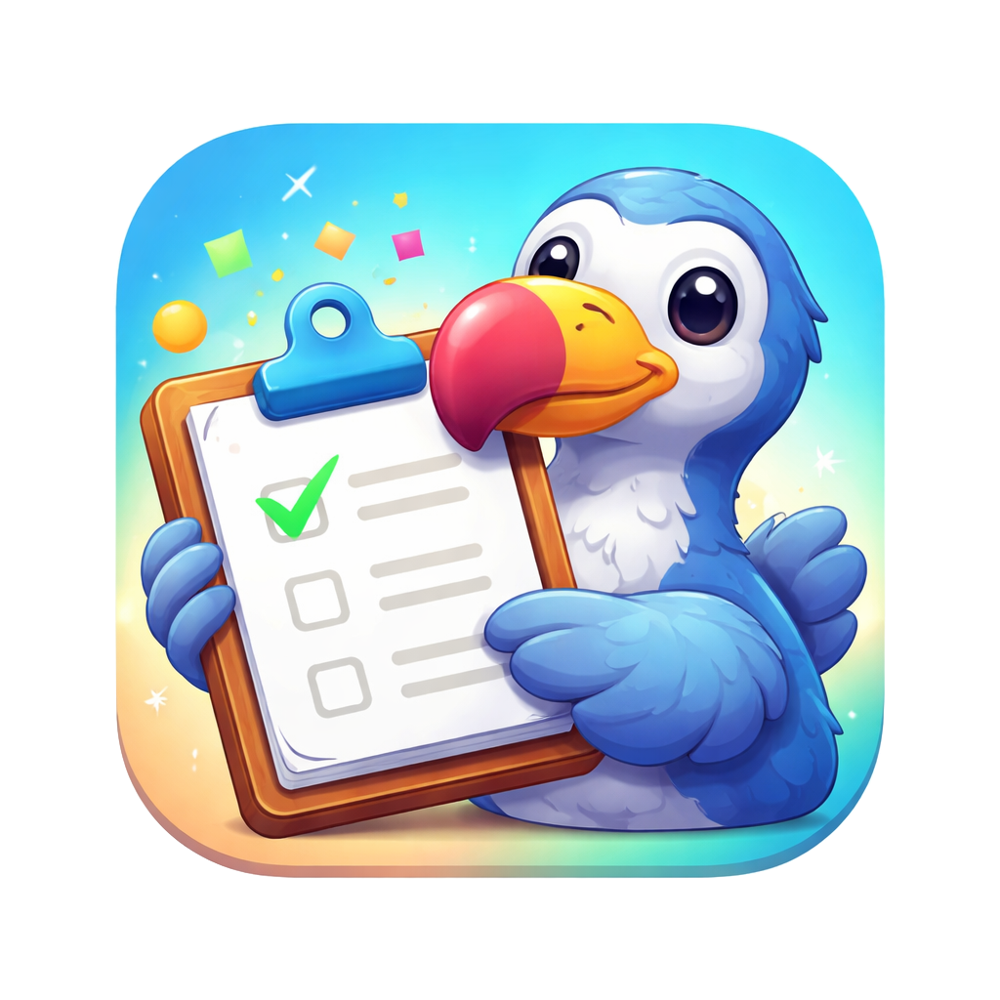

<p align="center">
  
</p>

<h1 align="center">DodoClip</h1>

<p align="center">
  macOS için ücretsiz, açık kaynaklı pano yöneticisi.
</p>

<p align="center">
  <a href="README.md">🇺🇸 English</a> •
  <a href="README.de.md">🇩🇪 Deutsch</a> •
  <a href="README.tr.md">🇹🇷 Türkçe</a> •
  <a href="README.fr.md">🇫🇷 Français</a> •
  <a href="README.es.md">🇪🇸 Español</a> •
  <a href="README.zh-Hans.md">🇨🇳 简体中文</a> •
  <a href="README.zh-Hant.md">🇨🇳 繁體中文</a>
</p>


https://github.com/user-attachments/assets/f281b654-a0a2-4883-b09c-21aa2cd3efb4


## Açıklama

DodoClip, SwiftUI ve SwiftData ile geliştirilmiş hafif, yerel bir pano yöneticisidir. Kopyaladığınız her şeyi takip etmenize ve pano geçmişinize anında erişmenize yardımcı olur.

## Özellikler

- **Pano geçmişi** - Kopyaladığınız her şeyi kalıcı olarak otomatik kaydeder
- **Arama** - Pano geçmişinizde öğeleri hızlıca bulun
- **Klavye kısayolları** - Global kısayollarla panonuza erişin (⇧⌘V)
- **Sabitlenmiş öğeler** - Önemli klipleri her zaman erişilebilir tutun
- **Akıllı koleksiyonlar** - Türe göre otomatik düzenleme (Bağlantılar, Resimler, Renkler)
- **Resim desteği** - Resimleri metinle birlikte kopyalayın ve yönetin
- **Bağlantı önizlemesi** - Otomatik favicon ve og:image çekme
- **Renk algılama** - Görsel önizleme ile hex renk kodlarını tanır
- **Yapıştırma yığını** - Sıralı yapıştırma modu (⇧⌘C)
- **Gizlilik kontrolleri** - Parola yöneticilerini ve belirli uygulamaları yoksay
- **Menü çubuğu erişimi** - Menü çubuğundan hızlı erişim

## Gereksinimler

- macOS 14.0 (Sonoma) veya üstü

## Kurulum

### Homebrew (önerilen)

```bash
brew tap bluewave-labs/tap
brew install --cask dodoclip
xattr -cr /Applications/DodoClip.app
```

Veya tap eklemeden doğrudan yükleyin:

```bash
brew install --cask bluewave-labs/tap/dodoclip
xattr -cr /Applications/DodoClip.app
```

### Doğrudan indirme

[Releases](https://github.com/bluewave-labs/dodoclip/releases) sayfasından en son `.dmg` dosyasını indirin, açın ve DodoClip'i Uygulamalar klasörünüze sürükleyin.

Kurulumdan sonra uygulamayı açmak için bu komutu çalıştırın:

```bash
xattr -cr /Applications/DodoClip.app
```

## Kaynak Koddan Derleme

1. Depoyu klonlayın:
   ```bash
   git clone https://github.com/bluewave-labs/dodoclip.git
   cd DodoClip
   ```

2. Swift Package Manager ile derleyin:
   ```bash
   swift build
   ```

3. Uygulamayı çalıştırın:
   ```bash
   swift run DodoClip
   ```

## Lisans

Bu proje MIT Lisansı altında lisanslanmıştır - detaylar için [LICENSE](LICENSE) dosyasına bakın.

## Katkıda Bulunma

Katkılarınızı bekliyoruz! Pull Request göndermekten çekinmeyin.
